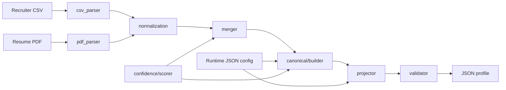

# Eightfold Candidate Profile Merger

Production-quality Python pipeline that ingests **recruiter CSV** (structured) and **resume PDF** (unstructured), then produces one **canonical candidate profile** with normalization, confidence-based merging, provenance, config-driven projection, and JSON Schema validation.

## Architecture



**Module responsibilities**

| Module | Role |
|--------|------|
| `parsing/` | Extract partial profiles from CSV and PDF |
| `normalization/` | Emails, phones (E.164), dates (`YYYY-MM`), skills, location object |
| `confidence/` | Heuristic per-field confidence scoring |
| `merging/` | Confidence-based conflict resolution across sources |
| `canonical/` | Assemble assignment schema (`emails[]`, `provenance[]`, `overall_confidence`) |
| `projection/` | Apply runtime config (field selection, remapping, metadata toggles) |
| `validation/` | JSON Schema check on final output |
| `pipeline.py` | Orchestrates the full flow |
| `cli.py` | `argparse` entry point |

## How to run the CLI

```bash
cd eightfold
python -m venv .venv
.venv\Scripts\activate          # Windows
pip install -r requirements.txt
pip install -e .

# Generate sample resume PDF (if needed)
python scripts/generate_sample_pdf.py

# Run with full metadata
python -m eightfold_profile \
  --csv samples/recruiter.csv \
  --pdf samples/resume.pdf \
  --config config/sample_config.json \
  --candidate-id CAND-1001 \
  --pretty

# Write to file
eightfold-profile \
  --csv samples/recruiter.csv \
  --pdf samples/resume.pdf \
  -o samples/output.json
```

**CLI flags**

| Flag | Description |
|------|-------------|
| `--csv` | Recruiter CSV path (required) |
| `--pdf` | Resume PDF path (required; missing/malformed PDF falls back to CSV-only) |
| `--config` | Runtime JSON config |
| `--candidate-id` | Select row when CSV has multiple candidates |
| `-o`, `--output` | Write JSON to file |
| `--pretty` | Pretty-print JSON to stdout |

## Canonical output schema

| Field | Shape |
|-------|-------|
| `emails` | `[{value, confidence, primary}]` |
| `phones` | `[{value, confidence, primary}]` |
| `location` | `{city, region, country, formatted}` |
| `skills` | `[{name, confidence, sources}]` — `sources` lists contributing inputs |
| `experience` | `[{title, company, start, end, summary}]` |
| `education` | `[{institution, degree, field, end_year}]` |
| `provenance` | `[{field, source, raw_value, extractor, confidence}]` |
| `overall_confidence` | `float` in `[0, 1]` |

See `samples/expected_output.json` for a full example.

## Sample input

**Recruiter CSV** (`samples/recruiter.csv`):

```csv
candidate_id,first_name,last_name,email,phone,location,current_title,current_company,skills,...
CAND-1001,Jane,Doe,jane.doe@example.com,(415) 555-0199,"San Francisco, CA",...
```

**Resume PDF** (`samples/resume.pdf`): machine-readable text with `EXPERIENCE`, `EDUCATION`, and `SKILLS` sections. A conflicting work email and phone are included to exercise merging.

## Sample output (excerpt)

```json
{
  "candidate_id": "CAND-1001",
  "full_name": "Jane Doe",
  "emails": [
    {"value": "jane.doe@example.com", "confidence": 0.99, "primary": true},
    {"value": "jane.doe@work-email.com", "confidence": 0.88, "primary": false}
  ],
  "location": {
    "city": "San Francisco",
    "region": "CA",
    "country": "US",
    "formatted": "San Francisco, CA"
  },
  "skills": [
    {"name": "Python", "confidence": 0.95, "sources": ["recruiter_csv", "resume_pdf"]}
  ],
  "experience": [
    {
      "title": "Senior Software Engineer",
      "company": "Acme Corp",
      "start": "2022-01",
      "summary": "Built APIs and data pipelines..."
    }
  ],
  "education": [
    {
      "institution": "State University",
      "degree": "B.S",
      "field": "Computer Science",
      "end_year": 2018
    }
  ],
  "overall_confidence": 0.89
}
```

## Assumptions

1. **CSV** is UTF-8 with a header row; column names are case-insensitive with common aliases.
2. **PDF** contains extractable text (not scanned images); US-style section headers are expected.
3. **Phones** default to `default_country_code` (usually `US`) when no country code is present.
4. **Dates** normalize to `YYYY-MM`; `Present`/`Current` become open-ended (`end` omitted).
5. **Education years** are stored internally as `YYYY-MM` but emitted as integer `end_year`.
6. **Missing/malformed PDF** degrades gracefully: the pipeline merges CSV-only data instead of failing.
7. **Single candidate** per run: one CSV row (or `--candidate-id`) plus one PDF.

## Merge policy

| Data type | Policy |
|-----------|--------|
| **Scalars** (name, title, etc.) | Pick value with highest *effective confidence* (`confidence + source_bonus`). |
| **Emails / phones** | Union all unique normalized values; sort by confidence descending; first entry is `primary`. |
| **Skills** | Union by canonical name; boost confidence when both sources contribute; record `sources[]`. |
| **Experience / education** | Union entries by key (title+company+start or institution+degree+year); prefer higher-confidence source ordering. |
| **Location** | Pick highest-confidence structured location object. |
| **Provenance** | Flat `provenance[]` at profile root; duplicate `(field, source, raw_value)` rows removed. |

**Source tie-breakers** (via `source_bonus`):

- Recruiter CSV +0.02 for HR-maintained fields: `emails`, `phones`, `location`, `current_title`, etc.
- Resume PDF +0.02 for `skills`, `summary`, `full_name`.

## Confidence policy

### Per-field scoring

| Source | Typical range | Notes |
|--------|---------------|-------|
| CSV `candidate_id`, `email` | 0.97 | Structured ATS data |
| CSV `phone` | 0.94 | Structured contact |
| CSV other scalars | 0.92 | Default structured base |
| PDF name | 0.55–0.78 | Heuristic from header line |
| PDF email / phone | 0.82–0.88 | Regex extraction |
| PDF skills | 0.55–0.80 | Scales with skill count |
| PDF experience / education | 0.35–0.85 | Scales with fields parsed |

### Multi-source boost

When multiple sources agree on the same value, confidence receives `+0.05 × (num_sources − 1)` (capped at 1.0).

### `overall_confidence`

Computed as the **unweighted arithmetic mean** of all field-level confidence scores present in the merged profile:

```
overall_confidence = mean([
  scalar field confidences,
  location confidence,
  each email confidence,
  each phone confidence,
  each skill confidence,
  experience block confidence,
  education block confidence,
])
```

If no scores exist, `overall_confidence` is `0.0`. The result is rounded to four decimal places.

Omit `overall_confidence` when `include_confidence` is `false` in the runtime config.

## Runtime config

`config/sample_config.json` supports:

| Key | Description |
|-----|-------------|
| `output_fields` | Fields to emit |
| `field_mapping` | Rename output keys |
| `include_confidence` | Per-item confidence + `overall_confidence` |
| `include_provenance` | Top-level `provenance[]` |
| `missing_value_behavior` | `null`, `omit`, or `error` |
| `default_country_code` | Phone/location default region |
| `skills_synonyms` | Extra skill alias mappings |

## Tests

```bash
pytest
```

## License

MIT (sample / educational project)
